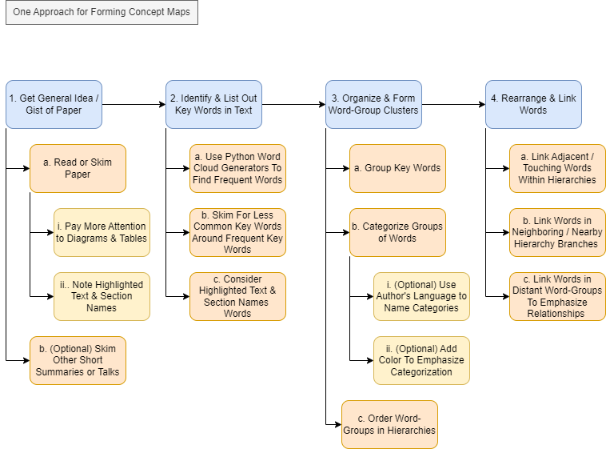
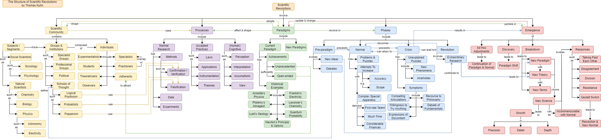

# concept_maps
**Description:** Approaches and tinkering with ideas for making concept maps

## One Manaul Approach with Some Automation

## Example Result
(from Thomas Kuhn's [_The Structure of Scientific Revolutions_][kuhn])

## Status & Possible Future To-dos
[x] develop manual process
[x] automate ingestion of pdf text
[x] automate word cloud generation
[ ] improve ideas for overall process 
[ ] improve automation (less common key terms, grouping, categorizing, concept map generation)
[ ] consider tying to other methods e.g., LLMs 

# Misc. Links
1. [Word cloud generation][wordcloud]

[wordcloud]: https://github.com/dhatm/word_clouds/
[kuhn]: https://github.com/dhatm/word_clouds/blob/main/reading/Kuhn-SSR-2ndEd.pdf

